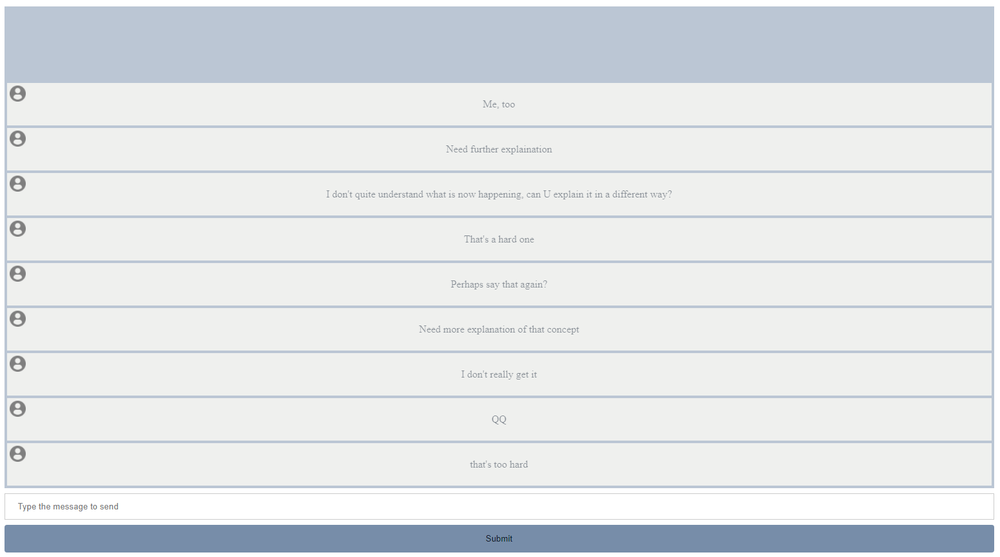
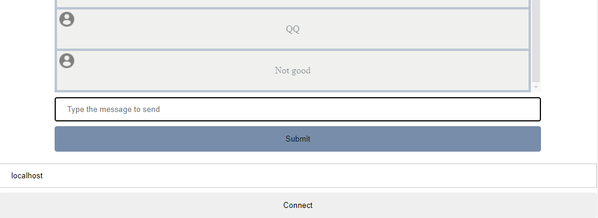

# Introduction

This is a simple project for NCU's computer network.

## Overview

This is a bullet screen system with a chat room, users can send their questions to the host in a presentation so that the host don't need to change to another screen or application to see a question. 

### Client Computer view


### Client Phone view


# Technologies Used

## Breif explanation
As a frequently connecting service, the system can be done by webhooks such as periodly fetching data from server. However, since the system requires constantly communications, the service will definately become slow and accompany with high loads. That's why The project introduce websocket, which keeps the tcp connection alive and bi-directions.

*Note* <br>
Since this project is for NCU's computer network course, a socket api is required; therefore, this project uses a socket to provide a websocket.

## Technologies
- [socket](app/modules/socket/README.md) (A Web Server for socket connections)
- [websocket](app/modules/websocket/README.md) (Connections between clients, server and the host)
- [header](app/modules/header/README.md) (To parse the datas)
- client & host page (frontend renderer for the project)

# Usage

## Preinstallation

Only docker is needed
```sh
> docker -v
Docker version 20.10.11, build dea9396
```

pull your presentation `.pdf` file in the same folder as `host.html`

for example you have `example.pdf` is your presentation file
```sh
> tree /f <your place>
.
│  host.html
│  sample.pdf
└─ js
       com.js
       text.js
```

Modify your `.env` file
```.env
# Deployment settings
FRONTEND_PORT=<Expected frontend port> (Or you can just give the file to user)
BACKEND_PORT=<Expected backend port> (Where your server runs at)

# Backend Settings
HOST= <Your Ip>
PORT= <Expected Port>
BACKLOG= <Backlog> (Maximum connections for the same time)
```

## Run Service

```sh
docker-compose up -d
```

## Test 

[host](http://localhost:8000/host.html) <br>

- Enter the Host IP (`<IP>:<Port>` if port is not 80)
- Choose the presentation file
- Submit
  
[client](http://localhost:8000/client.html) <br>

- Pull to the bottom
- Enter the Host IP (`<IP>:<Port>` if port is not 80)

## Enjoy

